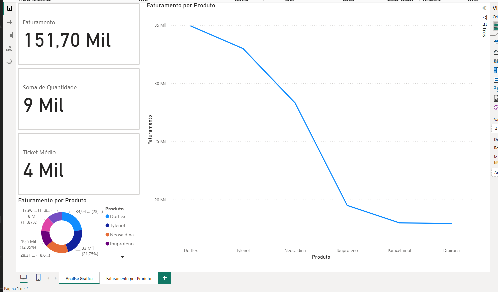

📊 Projeto ETL + Power BI — Análise de Vendas

Objetivo:
Criar um pipeline de dados automatizado em Python que lê arquivos CSV de vendas, carrega no SQL Server e disponibiliza para análise no Power BI.

🧱 Tecnologias utilizadas

🐍 Python (pandas, pyodbc, shutil) — ETL dos arquivos CSV

🧩 SQL Server (AnalyticsDB) — Banco de dados relacional

📈 Power BI — Visualização e análise de dados

💾 CSV (planilhas) — Fonte de dados simulada

⚙️ Como funciona o fluxo
📂 CSVs → 🐍 Python ETL → 🧱 SQL Server → 📊 Power BI

O Python lê todos os arquivos da pasta /planilhas

Insere os dados na tabela vendas

Move os arquivos para /processado ou /error

O Power BI se conecta ao banco e atualiza os relatórios

🧮 Métricas e KPIs criados no Power BI

💰 Faturamento Total

📦 Quantidade Vendida

🎟️ Ticket Médio

📈 Crescimento Mensal

🏆 Produto Mais Vendido

📷 Dashboard

Exemplo:

